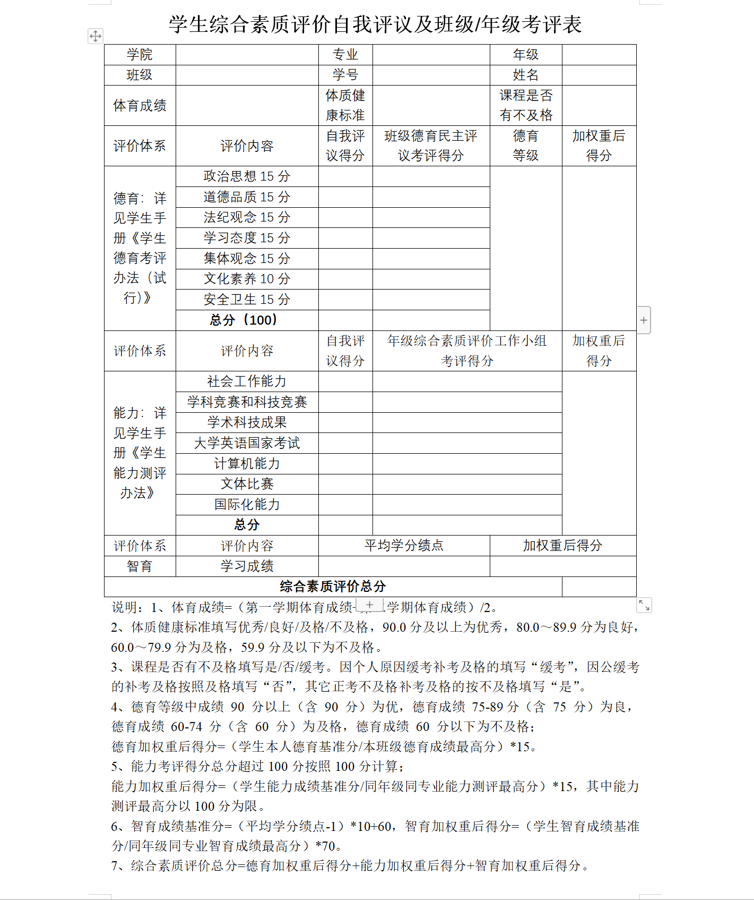
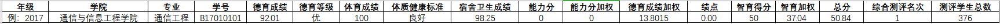

# Student Management Information System
技术栈：Spring Boot + MySQL(JPA) + Redis + Spring Security

## 大纲

- [x] 用户管理
  - [ ] 注册
  - [ ] 登录(学号密码登陆,学号是唯一索引)
  - [ ] 忘记密码
  - [ ] 个人中心
  - [ ] 权限控制
  - [ ] 注销
- [x] 各权限用户可执行操作
  - [ ] 学生:填表单申请,一键导出(附件一)
    - [ ] 查看自己的竞赛、绩点、综测成绩、以及年级排名
    - [ ] 德育、能力部分自我评测表单填写
    - [ ] 提交自己的竞赛信息以及相应证明文件
      - [ ] 表单形式，学生申报
      - [ ] 内容以选择为主，学生新增申请
      - [ ] 填写的内容允许自定义，不只是论文、专利、竞赛这些
  - [ ] 班委:(单个班级附件二)
    - [ ] 班级民主评议考评填写
    - [ ] 初步审核(年级综合素质评价小组考评得分审核),可以给每条记录加tag(表示初步审核结果)
  - [ ] 辅导员:(所有附件二)
    - [ ] 最终审核,改变记录tag的状态(表示最终审核结果)
    - [ ] 查看所管学生的竞赛、绩点、综测成绩、排名、以及所管学生的平均成绩
    - [ ] 综测德育分、能力分更正/重新提交权限（防止能力分通过竞赛成绩自动计算时出现偏差）
    - [ ] 学生提交竞赛信息的审批功能
    - [ ] 给班长和团支书赋权限(给用户赋权限)
  - [ ] 管理员:(附件二)
    - [ ] 查看所管学生的竞赛、绩点、综测成绩、排名、以及所管学生的平均成绩
    - [ ] 综测成绩导出到Excel
    - [ ] 学生提交竞赛信息的审批功能
## 大致流程如下

## 附件一

## 附件二

